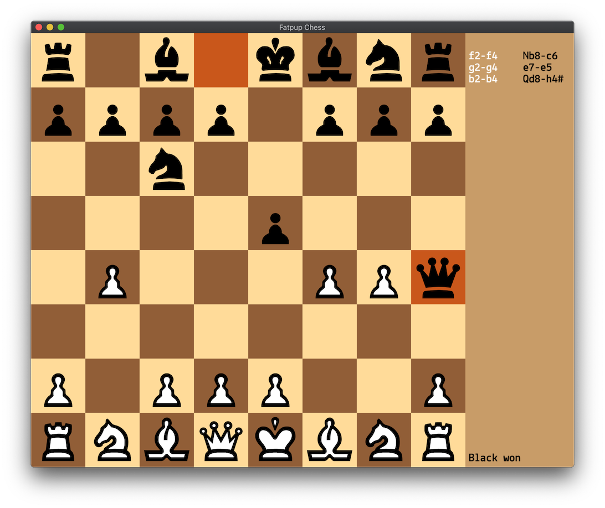

    
    
    
    
    
    
    
    
    
    
    
    

Sample UI for fatpup chess library based on SDL2. It's currently a user - engine game using MicroMax chess engine. You always play white, make a move and wait for the engine to reply (can take up to 10 seconds).

## Get the code
fatpup chess engine is submodule'd, so you have to pull it separately:

    git clone https://github.com/witaly-iwanow/fatpup-ui-sdl.git
    cd fatpup-ui-sdl
    git submodule update --init --recursive

## Build (macOS)
Install v2 SDL, SDL_image and SDL_ttf with Homebrew:

    brew install sdl2 sdl2_image sdl2_ttf

Throw it under CMake, make it and run:

    mkdir _cmake && cd _cmake
    cmake ..
    make && ./fatpup-ui

or if you need an Xcode project:

    cmake -GXcode ..
    Open fatpup-ui.xcodeproj

## Build (Linux)
Install v2 SDL, SDL_image and SDL_ttf with apt/yum:

    sudo apt install libsdl2-dev libsdl2-image-dev libsdl2-ttf-dev

or

    sudo yum install SDL2-devel SDL2_image-devel SDL2_ttf-devel

Throw it under CMake, make it and run:

    mkdir _cmake && cd _cmake
    cmake ..
    make && ./fatpup-ui

## Build (Windows)
Download the latest v2 SDL, SDL_image and SDL_ttf **Development** libraries (as of the time of writing [SDL 2.0.10](https://www.libsdl.org/release/SDL2-devel-2.0.10-VC.zip), [SDL_image 2.0.5](https://www.libsdl.org/projects/SDL_image/release/SDL2_image-devel-2.0.5-VC.zip) and [SDL_ttf 2.0.15](https://www.libsdl.org/projects/SDL_ttf/release/SDL2_ttf-devel-2.0.15-VC.zip)) and unzip them somewhere nice and tidy, i.e. no spaces in the path, C:\sdl for example.  

Throw it under CMake with paths to SDL, SDL_image and SDL_ttf set:

    mkdir _cmake && cd _cmake
    cmake -DSDL2_PATH=C:\sdl\SDL2-2.0.10 -DSDL2_IMAGE_PATH=C:\sdl\SDL2_image-2.0.5 -DSDL2_TTF_PATH=C:\sdl\SDL2_ttf-2.0.15 ..

Open fatpup-ui.sln with Visual Studio and set fatpup-ui as startup project. You're all set, feel free to hit Ctrl-F5 to see it running.

