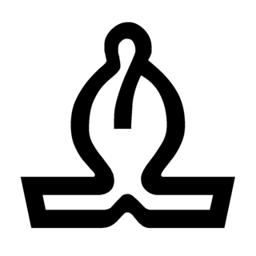
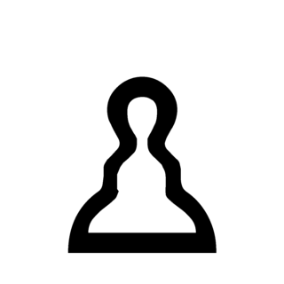

    
    
    
    
    
    
    
    
    
    
    
    

Sample UI for fatpup chess library based on SDL2

## How to build

Clone:

    git clone https://github.com/witaly-iwanow/fatpup-ui-sdl.git

Fetch submodules:

    cd fatpup-ui-sdl
    git submodule update --init --recursive

Install SDL2 (Linux):

    sudo apt install libsdl2-dev libsdl2-image-dev

Install SDL2 (macOS):

    brew install sdl2 sdl2_image

Install SDL2 (Windows):

    coming up shortly...

Build & run:

    mkdir _cmake
    cd _cmake
    cmake ..
    make
    ./fatpup-ui
